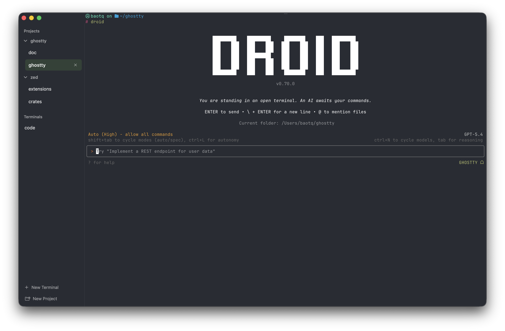

# Spectre

A MacOS terminal emulator for managing your CLI Agents easily across projects.  
[About](#about) · [Building](#building) · [Development](#development) · [Distribution](#distribution) · [Contributing](#contributing)

<p align="center">
  
</p>

<p align="center">
  <em><strong>One terminal.</strong> All your projects. Orchestrate multiple CLI agents—all at once.</em>
</p>

## About

Spectre is a fork of [Ghostty](https://ghostty.org) that is designed for the AI era. While Ghostty focuses on being a fast, feature-rich terminal emulator, Spectre takes a different approach—organizing your terminal sessions around **projects** and **agent sessions** using a vertical tab interface with grouping capabilities.

Think of it as what [Arc Browser](https://arc.net/) did for Chrome, but for your terminal: a complete rethinking of how you interact with command-line sessions when working with AI agents across multiple projects.

### Key Features

- **Vertical Tab Bar**: A sidebar-first design that keeps your sessions organized and accessible
- **Project Grouping**: Group terminal sessions by project/folder, making it easy to context-switch between different workspaces
- **Fast, Native, Feature-Rich**: Inherits all of Ghostty's performance and native platform integration
- **Standards Compliant**: Fully compatible with all existing shells, tools, and terminal applications

### Who is Spectre For?

- 100x developers working with CLI agents across multiple repositories
- Users who need to maintain multiple terminal contexts simultaneously
- Teams managing microservices or multi-project workflows
- Anyone who wants a more organized, project-centric terminal experience

## Building

### Prerequisites

- **Zig** (version specified in `build.zig.zon`)
- **macOS**: Xcode 26 and macOS 26 SDK (see [Xcode Setup](#xcode-setup))
- **Linux**: GTK development libraries, `blueprint-compiler` (0.16.0+)

### Quick Start

```bash
# Clone the repository
git clone https://github.com/yourusername/spectre
cd spectre

# Build the debug version (default)
zig build

# Run Spectre
zig build run
```

### Build Commands


| Command                               | Description                       |
| ------------------------------------- | --------------------------------- |
| `zig build`                           | Build debug version (default)     |
| `zig build run`                       | Build and run Spectre             |
| `zig build -Doptimize=ReleaseFast`    | Build optimized release version   |
| `zig build -Doptimize=ReleaseSmall`   | Build size-optimized version      |
| `zig build test`                      | Run the test suite                |
| `zig build test -Dtest-filter=<name>` | Run specific tests                |
| `zig build dist`                      | Build source distribution tarball |
| `zig build distcheck`                 | Build and validate distribution   |


### Xcode Setup (macOS)

Building the macOS app requires Xcode with the proper SDKs:

```bash
# Ensure correct Xcode is selected
sudo xcode-select --switch /Applications/Xcode.app
```

> **Note**: Main branch development requires **Xcode 26 and the macOS 26 SDK**. You can use Xcode 26 on macOS 15 stable.

## Development

### Running in Development Mode

The default `zig build` produces a debug build with full logging:

```bash
# Build and run with debug output
zig build run

# Run with specific configuration
zig build run -- --config-file=/path/to/config
```

### Logging

Control logging via the `SPECTRE_LOG` environment variable:

```bash
# Enable all logging
SPECTRE_LOG=true zig build run

# Log to stderr only
SPECTRE_LOG=stderr zig build run

# Disable all logging
SPECTRE_LOG=false zig build run
```

On macOS, logs also go to the unified logging system:

```bash
# View logs in real-time
sudo log stream --level debug --predicate 'subsystem=="com.yourorg.spectre"'
```

### Code Formatting

```bash
# Format Zig code
zig fmt .

# Format Swift code (macOS)
swiftlint lint --fix

# Format other files
prettier -w .
```

### Testing

```bash
# Run all tests
zig build test

# Run specific tests
zig build test -Dtest-filter="parser"

# Run under Valgrind (Linux)
zig build run-valgrind
```

## Distribution

### Building for Release

```bash
# Build optimized release binary
zig build -Doptimize=ReleaseFast

# The binary will be in zig-out/bin/
./zig-out/bin/spectre
```

### macOS App Bundle

```bash
# Build the full macOS app bundle
zig build -Doptimize=ReleaseFast

# The app will be available for installation
```

### Installing Locally

```bash
# Install to system (after building)
# On macOS, drag the built app to /Applications, or run
cp -R zig-out/Ghostty.app /Applications/
# On Linux, the binary can be installed to ~/.local/bin

# Or use the install step if available
zig build install --prefix ~/.local
```

### Creating a Distribution

```bash
# Create source tarball
zig build dist

# Validate the distribution
zig build distcheck
```

### Platform-Specific Notes

**macOS:**

- The app bundle is built as part of `zig build`
- Requires proper code signing for distribution outside the App Store
- Gatekeeper may require notarization for distribution

**Linux:**

- Build produces a standalone binary
- GTK runtime dependencies are required on target systems
- Consider packaging as `.deb`, `.rpm`, or AppImage for distribution

## Project Structure

- `src/` - Core Zig code shared across platforms
- `macos/` - macOS-specific SwiftUI app code
- `src/apprt/gtk/` - Linux GTK app implementation
- `include/` - C API headers

## Roadmap


| Feature                             | Status |
| ----------------------------------- | ------ |
| Vertical tab sidebar                | ✅      |
| Project/folder grouping             | ✅      |
| Agent session management            | ✅      |
| Drag-and-drop tab organization      | 🚧     |
| Session persistence across restarts | 🚧     |
| Cross-platform `libspectre` library | 🚧     |


## Contributing

Spectre is a fork of Ghostty with a focused mission. We welcome contributions that align with our goal of making terminal session management more intuitive for AI-assisted development workflows.

Please read our [Contributing Guide](CONTRIBUTING.md) before opening pull requests.

## Acknowledgments

Spectre is built on the excellent foundation of [Ghostty](https://ghostty.org) by Mitchell Hashimoto and contributors. We're grateful for the fast, standards-compliant terminal emulator that made this fork possible.

## License

Spectre inherits the same license as Ghostty. See the original project's license file for details.

---

Built for the AI era. 🚀